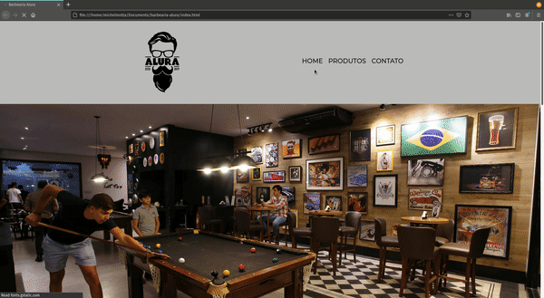

<h1 align="center">Barbearia Alura</h1>
<p align="center">Projeto desenvolvido durante o curso de Web Developer na plataforma <a href="https://www.alura.com.br">Alura</a>.</p>

<h3 align="center">
    
    <br>
    <p>Nossa missão é: "Proporcionar auto-estima e qualidade de vida aos clientes".</p>
</h3>

<h4 align="center"> 
	Concluído :heavy_check_mark:
</h4>

### Índice

- [Sobre](#sobre)
- [Tecnologias Utilizadas](#tecnologias-utilizadas)
- [Resultado](#resultado)
- [Como Usar](#como-usar)

## Sobre

O site da **Barbearia Alura** foi um projeto desenvolvido durante as aulas do curso de **Web Developer** na plataforma da [Alura](https://www.alura.com.br/sobre). O site possui uma página inicial com localização e vídeo de apresentação, uma página listando os produtos e uma página de formulário de cadastro.

## Tecnologias Utilizadas

O projeto foi desenvolvido utilizando as seguintes tecnologias:

- [HTML5](https://developer.mozilla.org/en-US/docs/Web/Guide/HTML/HTML5)
- [CSS](https://developer.mozilla.org/en-US/docs/Web/CSS)

## Resultado



## Como Usar

### Pré-requisitos

- Um editor de texto, preferencialmente voltado para programação (ex: Visual Studio Code, Sublime Text).
- Um navegador atualizado (recomenda-se Google Chrome ou Microsoft Edge).

### Passos

1. Faça um clone do repositório:

   	```sh
   	git clone https://github.com/michelmotta-dev/barbearia-alura.git
	```
2. Navegue até o diretório do projeto:

   	```sh
   	cd barbearia-alura
	```

3. Abra o arquivo index.html com o navegador de sua escolha e navegue livremente pelo site.

   
### Quem ministrou?

As aulas foram ministradas pelo professor **[Pedro Marins](https://www.linkedin.com/in/pedromarins/)** nas aulas da **Alura**.

<h1 align="center">
  
</h1>
